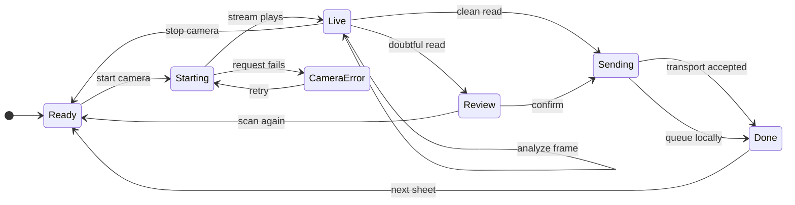

# DALIguro Camera and Scanner Reliability Audit

Audit date: 2026-07-10
Scope: live camera, photo/gallery input, device capabilities, QR validation, marker detection, perspective mapping, OMR, confidence, automatic/manual capture, phone-to-PC sync, evidence, accessibility, security, performance, and release certification.

## Audit boundary and release verdict

This report distinguishes three evidence levels:

- **Confirmed** — directly demonstrated by source or automated tests.
- **Synthetic only** — observed in generated-image/jsdom tests on the audit computer; not a phone benchmark.
- **Unverified** — requires real hardware, real printed sheets, or production-like networking.

No physical device lab or ground-truth photo corpus was available. Therefore no phone, tablet, browser, camera, accuracy percentage, battery result, or thermal result is certified. Values that were not measured are explicitly reported as **Not measured**.

Release verdict: **Not production ready for unattended automatic scoring. Internal controlled pilot only.** Keep a teacher in the verification loop and do not use the present phone cloud rows as an authoritative record until P0 defects are fixed.

## Current camera architecture

### Desktop scanner path

1. `AnswerSheetScanner` requests `facingMode: "environment"`, falling back to any video input.
2. Each live iteration draws a frame to a 900 px canvas.
3. Native `BarcodeDetector`, when present, is tried; otherwise jsQR runs.
4. Corner-marker search and brightness checks run on the main thread.
5. A good condition held for 1.1 seconds triggers a canvas capture, capped at 1600 px.
6. `processStillImage` performs thorough QR recovery, local identity resolution, marker detection/homography, OMR, basic dark/blur checks, review construction, and quality scoring.
7. Clean scans may auto-save; doubtful scans enter Review. A compressed 800 px JPEG may be stored locally as evidence.

Evidence: `src/components/scanner/AnswerSheetScanner.tsx:30-42,97-180,214-355`; `src/lib/scanner/still-pipeline.ts:71-179`.

### Paired phone path

1. The phone opens a token-bearing pairing URL and joins a Supabase Realtime broadcast topic.
2. It requests an ideal 1920×1080 environment camera, falling back to any camera.
3. Canvas extraction is capped at 1300 px for live frames.
4. Native QR detection is attempted; the remainder normally runs in `omr-frame-worker.ts`. A 2-second timeout switches later frames to the main-thread fallback.
5. Three aligned reads keyed by learner ID and version are averaged before classification.
6. A clean result auto-submits; lower quality/doubt goes to a read-only phone review.
7. Detected answers are broadcast to the PC, scored locally there, optionally upserted into Supabase, and a score is broadcast back.

Evidence: `src/pages/SmartScanMobilePage.tsx:30-98,249-330,332-525,531-637`; `src/lib/scanner/omr-frame-worker.ts:1-30`; `src/components/smartscan/UsePhoneScannerPanel.tsx:151-194`.

### QR/OMR core

- QR: native detector where exposed; jsQR full-frame/cropped/inverted/contrast/threshold recovery otherwise (`src/lib/scanner/qr-detect.ts:86-138`).
- Geometry: four dark-component candidates → best quadrilateral → canonical-to-image homography (`src/lib/scanner/omr-detect.ts:130-326`).
- OMR: local background-adjusted bubble darkness and fixed classification thresholds (`omr-detect.ts:343-418`).
- Confidence: per-item classification confidence plus a weighted scan-quality score (`src/lib/scanner/scan-quality.ts:20-65`).

## State-flow assessment

The repository defines camera-state labels in `src/lib/camera.ts`, but the React scanners do not use that state machine. Desktop uses `idle/checking/requesting/live/error`; phone uses separate capture and sync strings. There is no central transition reducer, so invalid combinations cannot be ruled out structurally.

### Current effective flow

The dangerous transition is `Sending --> Done: transport accepted`: transport acceptance is not durable receipt.

### Required state machine

```mermaid
stateDiagram-v2
    direction LR
    [*] --> Idle
    Idle --> RequestingPermission: start
    RequestingPermission --> CameraReady: stream verified
    RequestingPermission --> CameraError: denied or failed
    CameraReady --> Positioning: preview active
    Positioning --> QualityChecking: sheet candidate
    QualityChecking --> Positioning: any hard gate fails
    QualityChecking --> ReadyToCapture: stable identity and geometry
    ReadyToCapture --> Capturing: automatic or manual
    Capturing --> Processing: still image frozen
    Processing --> RescanRequired: critical validation fails
    Processing --> ReviewRequired: uncertainty remains
    Processing --> AcceptedLocal: all gates pass
    ReviewRequired --> AcceptedLocal: corrections confirmed
    ReviewRequired --> RescanRequired: evidence insufficient
    RescanRequired --> Positioning: retry
    AcceptedLocal --> OfflineQueued: no committed server receipt
    AcceptedLocal --> Synchronizing: network available
    OfflineQueued --> Synchronizing: retry
    Synchronizing --> Synced: matching scan commit acknowledged
    Synchronizing --> OfflineQueued: retryable failure
    Synchronizing --> ConflictReview: duplicate or revision conflict
    Synced --> Positioning: next sheet
    ConflictReview --> Synced: explicit resolution
    CameraError --> RequestingPermission: retry
    CameraReady --> Idle: stop
```

## Confirmed defects and unverified risks

| ID | Stage | Severity | Evidence and root cause | Scoring/user impact | Required fix and acceptance test |
|---|---|---:|---|---|---|
| CAM-001 | Quality gate | **Critical** | `scanQuality` treats overexposure as full lighting credit and only adds a warning; auto-accept checks a low aggregate threshold, not hard gates (`scan-quality.ts:31-63`; `SmartScanMobilePage.tsx:433-440`; `CheckPanel.tsx:292-319`) | A glare/tilt/shadow/blur condition can be outweighed by other dimensions and auto-submitted | Central hard-gate result with blocking reason codes; test each critical defect cannot auto-accept even with perfect bubble confidence |
| CAM-002 | Auto capture | **Critical** | Desktop measures elapsed “good” time only; phone averages three aligned reads but computes no motion/corner displacement/optical stability (`AnswerSheetScanner.tsx:258-280`; `SmartScanMobilePage.tsx:478-509`) | The sheet can be moving while readable markers happen to persist | Require 5 consistent frames or ≥600 ms with bounded corner movement, sharpness, identity, scale, and exposure; motion-injection E2E test |
| CAM-003 | QR identity | **Critical** | Missing checksum is accepted, checksum is unkeyed, token is not verified, unknown version can default (`qr-parse.ts:50-64,95-118,172-189`) | Forged/malformed learner identity or wrong version can score | Mandatory signed schema and sheet nonce; reject missing/unknown fields; tamper/replay tests |
| CAM-004 | Phone assessment binding | **Critical** | Editable URL `a=` drives validation; broadcast has no assessment/revision; PC assigns its current assessment (`SmartScanMobilePage.tsx:123-130`; `pairing.ts:131-139`; `UsePhoneScannerPanel.tsx:165-170`) | A sheet can be accepted under the wrong assessment | Bind signed assessment revision and session to submission; server validates before commit |
| CAM-005 | Version gate | **High** | Both pipelines reject only a detected mismatch; a missing/unclear version bubble is accepted (`mobile-analyze.ts:134-137`; `still-pipeline.ts:139-148`) | Layer-two identity can disappear without blocking auto-score | Missing/ambiguous version is a hard review/rescan gate; blank/double/faint version tests |
| CAM-006 | Phone item mapping | **Critical** | Phone OMR row numbers map against all items instead of only OMR items (`CheckPanel.tsx:138-150,341-350`) | Mixed item types shift answers onto wrong IDs | Map immutable published OMR item IDs; mixed MC/essay regression test |
| CAM-007 | Delivery/outbox | **Critical** | Realtime `send()==ok` removes recovery before PC/database acknowledgement (`realtimeSmartScan.ts:57-63`; `SmartScanMobilePage.tsx:349-426`) | A completed scan can be lost when PC is absent | Durable scan UUID outbox retained until committed ack; offline/reload/no-listener test |
| CAM-008 | Cloud score | **Critical** | Phone DB row hard-codes score/percentage zero and correction true (`pairing.ts:169-188`; `UsePhoneScannerPanel.tsx:169-175`) | Cloud record is false while local UI looks correct | Store raw submission separately; persist scored result transactionally; integration test local/cloud equality |
| CAM-009 | Duplicate/replay | **High** | No scan ID, sheet nonce, capture fingerprint, or explicit duplicate decision; ack correlates only by learner (`pairing.ts:26-30,131-153`; `scan-save.ts:25-36`) | Delayed responses and rescans can replace or duplicate the wrong attempt | Idempotency key and duplicate comparison UI; replay and delayed-ack tests |
| CAM-010 | Phone review | **High** | The phone calls the screen “Confirm” but answers are not editable (`SmartScanMobilePage.tsx:753-779,878-896`) | Teacher can believe doubtful items were corrected; provisional score can be misunderstood | Editable uncertain rows or explicit “PC review required”; never show Passed for an unreviewed result |
| CAM-011 | Main-thread work | **High** | Desktop QR, marker detection, homography, and OMR run on main; phone fallback does too. Canvas draw/getImageData remains on main (`AnswerSheetScanner.tsx:233-283`; `SmartScanMobilePage.tsx:249-319`) | Controls can freeze on low-end hardware or difficult QR recovery | One worker pipeline for all paths, OffscreenCanvas/ImageBitmap when available, frame backpressure and cancellation; long-task test |
| CAM-012 | Quality proxies | **High** | Brightness/sharpness use the whole frame; “shadow” is variance of bubble fill (including real answers); “bubble darkness” averages marked and blank items (`omr-detect.ts:64-89`; `mobile-analyze.ts:63-100`; `still-pipeline.ts:51-69`) | Good sheets can be rejected and bad answer regions can pass | Calculate canonical-page/ROI illumination, glare, Laplacian focus, local uniformity, print references, and perspective residual independently |
| CAM-013 | Gallery input | **High** | `image/*` has no explicit type/size/pixel/metadata limits, cancellation, screenshot/duplicate detection, or batch handling (`SmartScanMobilePage.tsx:586-637`; `AnswerSheetScanner.tsx:182-203`) | Huge/malicious files can exhaust memory; unsupported images fail late | Validate MIME signature, bytes, decoded pixels, dimensions, orientation; worker decode; cancellable batch queue |
| CAM-014 | Camera lifecycle | **High** | No `track.ended`, `devicechange`, visibility, rotation, freeze, or background recovery handlers. Some start failures do not release the obtained stream (`SmartScanMobilePage.tsx:531-583`) | Hidden camera use, locked camera, or dead preview after interruption | Central lifecycle controller; always release on failure; automatic safe restart; background/rotation tests |
| CAM-015 | Capabilities | **Medium** | Rear camera is requested but never verified; no camera switch/zoom/manual focus; torch exists only on phone and fails silently (`SmartScanMobilePage.tsx:202-214,563-575`) | Decorative/missing controls and poor recovery on varied devices | Enumerate devices after permission, inspect settings/capabilities, conditionally render controls, show failure states |
| CAM-016 | Calibration | **High** | “Certification” is one locally stored assessment result, not bound to device/browser/camera/resolution/algorithm and has no expiry (`CheckPanel.tsx:205-227,277-303`; `calibration.ts`) | A stale or different camera can remain “certified” | Versioned device profile, expiry, first-batch readiness check, known printed calibration target, server/device registry |
| CAM-017 | Evidence/audit | **High** | Phone sends no image evidence; desktop keeps only compressed JPEG; corrections log a generic event without item deltas (`pairing.ts:131-139`; `ReviewPanel.tsx:55-86`) | A disputed score cannot be reconstructed or attributed | Evidence manifest with hashes, geometry/quality/item readings/algorithm version and append-only item correction events |
| CAM-018 | Evidence privacy | **High** | Images are plaintext local data, lack retention/expiry/access control, and “Clear all” leaves them behind (`offline-store.ts:184-217`; `BackupTools.tsx:60-82`) | Learner answer sheets persist after claimed deletion | User-scoped encrypted storage, retention policy, verified purge, evidence access log |
| CAM-019 | Session security | **Critical** | Public broadcast, bearer token echoed in messages/URL, expiry not enforced in live handler (`realtimeSmartScan.ts:14-68`; `UsePhoneScannerPanel.tsx:155-190,254-255`) | Injection, spoofed acknowledgements, expired-session scans | Authenticated server ingress, one-time exchange, server clock/expiry/rate/schema checks |
| CAM-020 | Maximum sheet size | **High** | More than 80 items can print a QR declaring an unsupported count while only 80 rows render (`AnswerSheet.tsx:92-100,283-318`) | Printed sheets are unscannable | Block publish/print above 80 or split revisions; boundary E2E test |
| CAM-021 | Accessibility | **Medium** | Camera state/error changes have no live region; stateful controls lack ARIA; focus-visible/disabled styling is incomplete (`ui.tsx:21-54`; camera components) | Screen-reader/keyboard users miss critical capture and failure feedback | Semantic grouped controls, `aria-live`, `aria-pressed`, focus restoration, 44 px touch targets, axe tests |
| CAM-022 | Metrics | **High** | Mean confidence is labeled “Scan Accuracy,” lost results are hard-coded zero, and no ground-truth/telemetry exists (`report-intel.ts:106-138`) | Product can overstate safety and hide losses | Event-derived metrics; ground-truth benchmark; remove claims until measured |

## PART 11 — Camera capability matrix

Certification below is DALIguro’s current certification, not a general claim about the platform. `BarcodeDetector` is feature-detected and has a jsQR fallback. Browser camera capabilities must be read per active track; not every capability is present on every device.

| Device class | OS | Browser | Rear camera | Torch | Zoom | BarcodeDetector | Worker | Auto-capture performance | Avg processing | Accuracy | Known limitation | Recommended fallback | Certification |
|---|---|---|---|---|---|---|---|---|---|---|---|---|---|
| Android phone, recent/high-end | Android | Chrome | Requested, not verified | Capability-gated on phone only | Not implemented | Native if exposed; jsQR fallback | Phone path attempts worker | Not measured | Not measured | Not measured | No motion gate/device lab; public sync | Photo + mandatory PC review | **Experimental** |
| Android phone, low-cost | Android | Chrome/WebView | Requested, not verified | Device-dependent | Not implemented | Feature-detect/fallback | Attempted; main-thread fallback | Not measured; high freeze risk | Not measured | Not measured | CPU/memory/thermal unknown | Lower-resolution photo, manual review | **Experimental** |
| Android alternative browser | Android | Firefox/Samsung Internet | Requested, not verified | Unknown until capability read | Not implemented | Do not assume; jsQR fallback | Feature-dependent | Not measured | Not measured | Not measured | No browser-specific tests | Gallery/photo + PC manual entry | **Experimental** |
| iPhone | iOS | Safari | Requested, not verified | Not certified | Not implemented | Do not rely on native; jsQR path exists | Attempted | Not measured | Not measured | Not measured | No iPhone hardware tests; camera controls vary | Photo capture + PC review | **Experimental** |
| iPad/tablet | iPadOS/Android | Safari/Chrome | Requested, not verified | Not certified | Not implemented | Feature-detect/fallback | Attempted | Not measured | Not measured | Not measured | Portrait-only PWA; landscape untested | Gallery/photo; desktop scanner | **Experimental** |
| Laptop/desktop webcam | Windows/macOS | Chrome/Edge | Usually not applicable; any video fallback | No | Not implemented | Feature-detect/fallback | Desktop scanner does not use worker | Not measured; camera geometry likely weak | Not measured | Not measured | Fixed/front webcam, low sheet resolution | Upload a high-resolution photo or manual check | **Experimental** |
| Mac webcam | macOS | Safari | Usually not applicable | No | Not implemented | jsQR fallback expected by design | Desktop scanner no worker | Not measured | Not measured | Not measured | No Safari desktop test | Upload photo/manual check | **Experimental** |
| Insecure LAN page | Any | Any | Browser blocks live camera | No | No | Irrelevant | Irrelevant | None | N/A | N/A | `getUserMedia` requires secure context | HTTPS deployment or file/photo input | **Unsupported** |
| Legacy/no-worker/no-camera browser | Any | Legacy/in-app | Unknown/no | No | No | jsQR may also fail | Main-thread fallback only | Unsafe/unmeasured | Not measured | Not measured | Missing secure APIs and performance budget | Manual checking on supported browser | **Unsupported** |

No row qualifies as **Supported** for automatic scoring because there are no real-device accuracy, long-batch, battery, thermal, or browser-version results.

## PART 12 — Camera button validation matrix

“Not verified” means no component/browser/device test demonstrates the behavior. Source inspection alone is not counted as certification.

| Button/control | Intended function | Current implementation | Current result | Failure condition | Loading behavior | Disabled-state behavior | Duplicate-click protection | Mobile behavior | Accessibility status | Required correction | Verification test |
|---|---|---|---|---|---|---|---|---|---|---|---|
| Start camera | Request permission and open preferred rear camera | Desktop `start`; phone `startLiveCamera` | Implemented | Insecure page, denied/busy/no device, play failure | Phone shows generic “Preparing”; desktop changes label | Disabled while phone `busy`/live; desktop checking/requesting | State-only; no synchronous start lock | Present | Text label, but status not live-announced | Central start lock, capability/readiness details, release stream on every failure | Double tap; deny; dismiss; busy camera; play reject; no rear camera |
| Stop camera | Cancel analysis and release tracks | Both call track `stop()` | Implemented | Track stop exception not surfaced; background end not observed | None | Only shown while live | Safe enough; repeated stop mostly idempotent | Present | Text label; no focus restoration | Transition to Idle atomically, await cleanup, restore focus | Stop during QR decode, worker task, torch on, and page navigation |
| Capture | Freeze current live frame | Desktop “Capture now”; absent on phone live view | Partial | Video not ready/canvas missing silently no-ops | None | Desktop never disabled for readiness | Desktop `capturingRef` blocks re-entry | Missing on phone | Label is clear; outcome not announced | Add phone manual capture with readiness state and common final validation | Capture while moving/dark/processing; rapid double tap |
| Automatic capture | Capture after sustained valid readiness | Desktop 1.1 s elapsed good state; phone 3 reads | Unsafe partial | No motion metric; hard quality gates incomplete | Hold counter/chip only | No explicit on/off control in phone | `capturingRef`/`submittingRef` reduce duplicates | Default phone behavior | Visual-only progress | Explicit auto toggle, motion/identity/geometry stability, frozen-still recheck | Moving sheet, alternating QR, focus hunting, glare burst |
| Manual capture | User-triggered still with same safety gates | Desktop capture; phone “Scan photo” may launch camera picker | Partial | Existing safety rules can still accept critical warnings | Desktop none; phone `busy` | Photo disabled while busy | File input reset; no capture transaction ID | Camera-picker behavior varies | Hidden file input not directly described | Use `ImageCapture.takePhoto()` when available, same hard gates, override reason | Compare auto/manual decisions for identical ground-truth image |
| Switch camera | Choose front/rear/other camera | Absent | Not implemented | Multiple/no rear cameras | N/A | N/A | N/A | Absent | N/A | Enumerate after permission, label cameras, stop old stream before switch | Two-camera Android/iPhone/tablet/laptop; switch during pause only |
| Flashlight | Toggle torch | Phone capability-gated `applyConstraints`; desktop absent | Partial | Constraint failure hides button without reason | No progress indicator | Hidden if unsupported; not disabled while applying | No race guard; rapid taps may reorder | Phone only | Text/emoji; no `aria-pressed` | Add applying/error state, `aria-pressed`, restore prior exposure, desktop if supported | Unsupported torch, rejection, rapid taps, stop with torch on |
| Zoom in | Increase optical/digital zoom safely | Absent | Not implemented | Capability absent/range error | N/A | N/A | N/A | Absent | N/A | Capability-based slider with min/max/step; never fake zoom via CSS | Range limits, unsupported device, resolution/accuracy comparison |
| Zoom out | Reduce zoom | Absent | Not implemented | Same as zoom in | N/A | N/A | N/A | Absent | N/A | Same zoom control; reset per session | Same as zoom-in plus reset after camera switch |
| Focus | Trigger/lock focus | Phone best-effort continuous focus; no button | Not user-controllable | Unsupported focus mode or apply failure is swallowed | None | No control shown | N/A | Automatic only | No status | Report focus capability/current sharpness; optional tap-to-focus only where real API supports it | Focus hunting, near/far sheet, unsupported capability |
| Rescan | Discard current interpretation and capture again | Desktop review “Scan again”; phone reset | Implemented with gaps | Pending transport/evidence can be confused with current scan | None | Phone next-sheet rules differ from rescan | No transaction/scan ID | Present | Text label; focus/state announcement missing | Explicitly distinguish Retake, Cancel, and Next; preserve committed prior scans | Retake before/after send, with outbox pending, keyboard activation |
| Use captured image | Accept a frozen image for processing | Processing starts automatically; no separate choice | Not implemented as a distinct control | User cannot inspect final frame before processing | Processing text only on phone photo | N/A | Implicit one-shot | Implicit | N/A | Show frozen still, critical gate results, Use/Retake when manual mode requires it | Final still worse than preview; use/retake race |
| Upload from gallery | Select existing image | Same hidden `image/*` input with `capture="environment"` | Ambiguous/partial | File too large, wrong signature, decode failure, EXIF/orientation | Phone busy text; desktop “Reading photo” | Button disabled only on phone busy | File input reset; no job ID/cancel | Some browsers may force camera instead of gallery | Button name “Scan photo” is ambiguous | Separate Camera and Gallery controls; validate bytes/pixels/type/orientation; add cancel | JPEG/PNG/HEIC policy, huge image, corrupt file, rotated image, screenshot |
| Retake image | Replace frozen/photo result | Implemented through “Scan again” | Partial | Does not model captured vs processing vs queued states | None | Varies | No scan job ID | Present after review/done | Text only | Retake state transition must cancel current uncommitted job and keep prior committed jobs | Retake during worker task, after failure, after local queue |
| Pause scanning | Keep stream but stop analysis/auto capture | Absent | Not implemented | Long batch interruption/background | N/A | N/A | N/A | Absent | N/A | Add Paused state; drain current worker; leave preview or stop track based on policy | Pause at each pipeline stage; ensure no auto capture while paused |
| Resume scanning | Resume from Paused safely | Absent | Not implemented | Stale frame/QR cache after pause | N/A | N/A | N/A | Absent | N/A | Clear QR/consensus caches and require fresh stable frames | Resume after sheet swap, rotation, background, network loss |
| Batch scan | Scan multiple sheets continuously | Desktop checkbox; phone repeats via Next | Partial | No long-session/memory certification, no undo/pause | No batch-wide progress | Checkbox always usable; next disabled in one sync state | Same-learner timers/upsert only; no scan ID | Phone has session count | Checkbox has native semantics; session feedback visual | Dedicated batch state, accepted/review/rejected/duplicate/offline counts, undo last | 10/40/60/100 sheets, duplicates, mixed versions, reload, heat |
| Review result | Inspect/correct uncertain answers | Desktop editable; phone read-only | Desktop functional; phone misleading | Evidence missing on phone scans; can save unresolved after confirm | None | Save not disabled by unresolved state | Save handler confirmation only | Read-only grid | Choice buttons need selected-state semantics; dynamic status not announced | Editable doubtful items or enforce PC review; evidence zoom; require override reason | Keyboard/screen reader correction; unresolved save; phone-to-PC handoff |
| Confirm submission | Commit reviewed scan | Phone Confirm; desktop Save result | Partial | Phone transport acceptance is mistaken for completion | Button text static except disabled pending | Phone disabled only for `pending`; desktop remains enabled | `submittingRef` on phone; no durable idempotency | Present | Text label; commit status not live-announced | Commit by scan ID; disable until valid transition; retain until server ack | Double click, timeout, delayed ack, server failure, reload |
| Cancel submission | Abandon uncommitted scan without losing prior data | No explicit Cancel; “Scan again” approximates it | Not implemented clearly | Ambiguous when a scan is sent/queued | None | N/A | N/A | Ambiguous | N/A | Add Cancel with confirmation and clear scope; never remove committed/outbox records implicitly | Cancel in Review, Processing, OfflineQueued, Synchronizing |

### Button matrix conclusion

Of the 20 requested controls, 5 are substantially implemented, 7 are partial/ambiguous, and 8 are absent as distinct controls. None has complete automated browser, mobile, failure-state, duplicate-click, and accessibility validation. Release success metric 6 is therefore **failed**.

## PART 13 — Camera failure-mode and effects analysis

Severity: S5 can create/lose an authoritative wrong result or expose sensitive data; S4 blocks/requires significant recovery; S3 degrades productivity; S2 minor. Probability is not numerically estimated because field telemetry does not exist. “Unknown-common” means the condition is normal in classrooms, not that a rate was measured.

| Failure mode | Cause | Detection method | Effect on scan | Effect on score | Severity | Probability | Current control | Recommended control | Recovery action | Required test case |
|---|---|---|---|---|---:|---|---|---|---|---|
| Camera permission denied/dismissed | User/browser policy | `getUserMedia` exception | No live preview | None if fallback used | S3 | Unknown-common | Friendly error mapping | Permission-state instructions, retry, gallery/manual fallback | Open settings or use photo/manual | Deny, dismiss, revoke after grant on each certified browser |
| Insecure context | HTTP LAN origin | `isSecureLike` | Camera unavailable | None | S3 | Unknown-common in local school networks | Blocks and explains HTTPS | HTTPS-only production and pairing validation | Open trusted HTTPS URL | Phone on HTTP IP, HTTPS, localhost |
| Wrong/front camera selected | Ideal constraint ignored/fallback | Read actual `getSettings().facingMode` | Low-resolution/mirrored sheet | Misread or repeated rejection | S4 | Unknown | None | Verify settings; enumerate/switch devices; warn front camera | Switch camera or gallery | Device with front+rear and ignored constraint |
| Camera busy/no device | Other app or no input | Start exception | No preview | None | S3 | Unknown | Error classification | Device enumeration and actionable retry | Close other app/retry/fallback | Camera used by another tab/app; no camera |
| Stream ends/freezes | OS interruption, background, hardware | `ended/mute` event and frame watchdog | Stale/no frames | Stale capture risk | S4 | Unknown-common | No handler | Frame timestamp watchdog and lifecycle recovery | Restart stream without clearing completed jobs | Background/foreground, screen lock, revoke permission |
| Sheet moves during auto capture | Hand motion/focus hunting | Corner displacement/optical flow across frames | Blurred or shifted still | Wrong bubble classification | **S5** | Unknown-common | Desktop elapsed hold; phone 3 reads | Motion hard gate and stable identity/geometry window | Resume preview and explain “Hold steady” | Translating/rotating sheet while markers remain visible |
| Blur in answer region | Focus/distance/motion | ROI Laplacian/MTF and still recheck | Weak/merged marks | False blank/choice | **S5** | Unknown-common | Whole-frame gradient; desktop hard minimum only | Canonical answer-ROI focus hard gate, multi-scale threshold | Refocus/move closer/retake | Controlled blur ladder with ground truth |
| Too dark | Poor light/shadow | Page/ROI luminance percentiles | Noisy weak marks | False blank/unclear | S5 | Unknown-common | Mean brightness; torch on some phones | Canonical illumination map and dark-region limit | Add light/torch/retake | Uniform dim + local shadow cases |
| Overexposure/glare | Flash/window/reflection | Saturated-pixel/glare-region ratio | Mark detail erased | False blank; current score can still be high | **S5** | Unknown-common | Warning only; quality formula gives full light credit | Hard glare/saturation gate per critical region | Re-angle/disable torch/retake | Specular glare over QR, version, and bubbles |
| Uneven shadow | Hand/device/room lighting | Canonical background field, not answer fills | Local thresholds drift | Region-specific errors | S5 | Unknown-common | Invalid proxy based on fill variance | Low-frequency illumination normalization and region gate | Reposition light/device | Half-page shadow with identical answers |
| Sheet cropped/partly hidden | Distance/position/finger | Four markers, page boundary, answer ROI coverage | Missing regions | False blanks/mapping | S5 | Unknown-common | Four-marker requirement | Page-edge/ROI coverage and obstruction checks | Show exact missing edge/corner | Crop each edge; cover answer/QR with finger |
| False marker quadrilateral | Table patterns/dark blobs | Marker topology, reprojection residual, template features | Wrong homography | Systematic wrong answers | **S5** | Unknown | Loose blob/shape heuristics | Validate target ring structure, page aspect, residual, QR-marker relationship | Reject and reposition background | Adversarial dark squares/table pattern |
| Extreme perspective/lens distortion | Oblique camera/wide lens | Homography condition/reprojection and cell scale | Bubble sampling offset | Systematic wrong answers | S5 | Unknown-common | Broad quad heuristic; no hard distortion limit | Perspective/scale/lens safety bounds | Flatten/recenter/zoom appropriately | Tilt/keystone/lens ladder by device |
| QR unreadable/partial | Blur, crop, low print, glare | Native/jsQR attempts | No identity | No score | S4 | Unknown-common | Multi-pass crops/contrast | QR-region guidance, decode timeout, quality reason code | Move closer/clean/reprint | Rotation, blur, partial, low contrast, multiple QR |
| Forged/tampered QR accepted | Missing signature/checksum optional | Cryptographic signature and schema validation | False identity appears valid | Wrong learner/assessment score | **S5** | Unknown-security | Optional unkeyed checksum | Mandatory signed payload, expiry/nonce/replay ledger | Reject and reprint authorized sheet | Remove checksum; edit learner/version/count; replay |
| Wrong assessment from URL tamper | Editable phone query and missing broadcast binding | Server compares signed sheet/session/revision | Wrong context | Score under wrong assessment | **S5** | Unknown-security | Phone compares against editable parameter | End-to-end server-bound IDs | Reject with QR_MISMATCH | Modify `a=` and submit another assessment sheet |
| Version bubble missing/ambiguous | Blank/faint/double version mark | Version classification result | QR version used alone | Wrong key possible if QR wrong | **S5** | Unknown-common | Only detected mismatch rejected | Missing/multiple is hard review/rescan | Shade correct version/reprint | Blank, faint, double, mismatched version row |
| Stale or >80-item sheet | Bank changed/limit not enforced | Signed revision/count and publish validation | Partial/unscannable form | Misalignment or rejection | S5 | Unknown | Count checks after capture; >80 print bug | Block publish/print; immutable revision | Reprint correct form | 0, 1, 80, 81 items; changed bank |
| Faint pencil/erasure/smudge | Real marking behavior | Adaptive features and explicit class | Uncertain answer | False choice/blank if threshold wrong | **S5** | Unknown-common | Unclear/low confidence class; no erasure class | Ground-truth model/features, erasure class, conservative review | Teacher verifies evidence or rescan | Pencil-strength, erasure, smudge dataset |
| Double mark | Two strong choices | Per-item fill count | Mark classified multiple | Should not score | S5 | Unknown-common | Multiple status → review | Preserve crops and require explicit decision/reason | Review/leave invalid per policy | Equal/unequal double marks, cross/check marks |
| Multi-frame disagreement averaged away | Alternating reads/geometry | Per-choice variance and agreement | Consensus hides instability | Confident wrong/unclear result | S5 | Unknown | Only averages fills | Store per-frame variance; hard agreement gate | Continue capture or rescan | Alternate A/B frames; moving shadow |
| Worker hangs/crashes | Browser/memory/algorithm | Timeout/error event | Frame dropped/fallback | Delay; possible UI freeze afterward | S4 | Unknown | 2 s timeout then main-thread fallback | Terminate/recreate worker, bounded retry, circuit breaker, visible limitation | Pause/restart or use photo | Crash, timeout, late response, repeated failure |
| Huge/corrupt gallery file | Malicious/accidental image | Byte/type/pixel limits before decode | Memory/CPU exhaustion | No result; app crash/data-loss risk | S4 | Unknown | Decode failure message only | Signature and resource limits; worker decode/cancel | Reject with exact reason | Zip/polyglot not applicable, huge JPEG, corrupt/truncated image |
| Duplicate/replay submission | Re-scan, retry, delayed message | `scanId`, sheet nonce, payload/evidence hash | Second/overwrite event | Wrong official attempt/audit | **S5** | Unknown-common | Local upsert/timers only | Idempotent ledger and explicit Keep/Replace/Compare | Teacher resolves conflict | Same packet twice, same sheet new image, delayed ack |
| Network loss after broadcast accepted | Ephemeral Realtime semantics | Missing committed ack deadline | Phone says sent; PC never saves | Lost score | **S5** | Unknown-common | Queue only on send failure | Durable local outbox until server commit | Auto retry after reconnect/PC return | Online phone, closed PC; reload before ack |
| Database write fails/zero-score row | RLS/network/current row builder | Transaction result and local/cloud parity check | Local-only or false cloud row | Cloud score zero/wrong | **S5** | Confirmed code path | Boolean upsert; current zero row | Transactional scored write, typed error, reconciliation | Keep pending; retry; never claim synced | DB reject, timeout, RLS deny, local/cloud equality |
| Local storage full/blocked | Quota/private mode | Awaited verified commit and quota check | Evidence/outbox/state not durable | Result can disappear | S5 | Unknown-common | Exceptions swallowed | Storage health, persistence request, backpressure, export/retry | Stop batch; export encrypted recovery package | Quota exhaustion during scan/evidence/outbox |
| Manual correction not reconstructable | Generic mutable client audit | Append-only item event comparison | Review completes | Disputed score lacks provenance | S4 | Confirmed | Generic “reviewed” event | Actor, old/new, item, reason, timestamp, evidence hash | Supervisor review/reopen | Correct 1/5/20 items; verify immutable event stream |
| Long batch degradation | Memory growth, heat, unresolved URLs/work | Telemetry and soak profiling | Slower preview/crash | Missing/duplicate later scans | S5 | Unknown | No soak suite | Memory budgets, resource cleanup, batch checkpoints, thermal warning | Pause, persist, resume on another device | 10/40/60/100 sheets with rotations/reconnects |

### FMEA priority

The first safety work is CAM-001 through CAM-009: quality hard gates, true stability, signed/bound identity, correct item mapping, durable delivery, authoritative score persistence, and idempotency. UI polish cannot compensate for those failures.

## PART 14 — Camera benchmark results

### Benchmark validity statement

There is no benchmark harness, physical device lab, production telemetry, or verified ground-truth image dataset in the repository. The normal test run passed 217/217 tests. Synthetic scanner tests pass, but their per-test times vary substantially with jsdom startup, CPU contention, generated-image size, and parallel execution; they are not phone performance or accuracy measurements.

Observed only as a smoke-test indication on the audit computer:

- a synthetic 40–80-item `readSheet` case reported tens of milliseconds in the normal suite, with larger values under contention;
- the noisy cropped jsQR synthetic case ranged from sub-second to several seconds across runs;
- the rendered QR + OMR + scoring E2E case likewise ranged from sub-second to several seconds across runs.

That variability is why no SLA or device certification may be inferred from these figures.

| Required metric | Current result | Evidence/interpretation | Production target and measurement method |
|---|---|---|---|
| 1. Frames analyzed per second | **Not measured**. Code requests at most about 11.1 analysis starts/s from the 90 ms phone throttle, but actual rate is lower because each loop awaits processing | `SmartScanMobilePage.tsx:68-78,445-525` | p50/p95 analyzed FPS per certified device over 1/10/40/100-sheet runs; controls remain responsive |
| 2. Camera startup time | **Not measured** | No timestamp from click → first decoded video frame | Instrument permission start, stream acquired, `loadedmetadata`, first frame; p95 ≤2 s after permission on supported devices |
| 3. Automatic-capture delay | Desktop configured hold = 1100 ms after its limited good condition. Phone requires 3 analyzed reads, not a measured stable duration | `AnswerSheetScanner.tsx:40,258-275`; `SmartScanMobilePage.tsx:60-70,478-509` | Measure first all-gates-pass → still capture; target 0.5–1.5 s with motion safety |
| 4. QR decoding time | **No valid device result**; synthetic test timing only | Native and jsQR paths are not separately instrumented/persisted | p50/p95 per native/fast/thorough path and image condition; log only non-PII duration/reason |
| 5. OMR analysis time | **No valid device result**; synthetic logic tests pass | UI exposes only the latest combined worker time | Split marker, homography, sampling, classification p50/p95 for 20/40/60/80 items |
| 6. Total processing time | **Not measured end-to-end on hardware** | No capture → review/local commit/server commit trace | Correlation ID spans capture, processing, local commit, server commit; result preview p95 ≤2 s typical supported phone |
| 7. Main-thread blocking time | **Not measured; structural risk confirmed** | Desktop does all analysis on main; phone canvas/native QR and fallback use main | PerformanceObserver long-task total/max; no task >50 ms during active controls, strict p95 budget |
| 8. Memory use | **Not measured** | No heap/native image buffer telemetry or soak test | Browser profiler + device memory sampling at start/10/40/100 sheets; bounded plateau and no retained images/workers |
| 9. Battery effect | **Not measured** | No battery protocol | Standard 40-sheet session from fixed battery/brightness/network; report percentage/hour per device class |
| 10. Thermal effect | **Not measured** | Web code has no reliable cross-browser thermal API | Physical temperature/throttling protocol; record FPS/latency drift and OS warnings during 100-sheet run |
| 11. Rescan rate | **Not measured** | No event ledger; UI reliability report cannot derive it | Rejected/rescan-required scans ÷ capture attempts by reason/device/condition |
| 12. Review rate | **Not reliably measured** | Current result state can count pending/reviewed but lacks capture denominator and device context | Review-required accepted scans ÷ valid processed sheets, separated from rejects/rescans |
| 13. False-acceptance rate | **Not measured — release blocker** | No ground truth | Wrong automatically accepted sheets ÷ all auto-accepted sheets; target zero in certification corpus and extremely high precision in field pilot |
| 14. False-rejection rate | **Not measured** | No ground truth | Valid sheets incorrectly rejected ÷ valid ground-truth sheets, by reason and condition |
| 15. Correct-answer classification rate | **Not measured on realistic images** | Synthetic classification tests pass only generated cases | Correct item classifications ÷ ground-truth item observations; report selected/blank/multiple/erasure separately |

Additional accuracy measures required before release: sheet detection, QR decode, template/learner identity, blank, multiple, erasure, review recall, rejection accuracy, duplicate prevention, offline recovery, and synchronization success. Automatic-acceptance **precision**, not broad average accuracy, is the primary safety metric.

### Benchmark instrumentation specification

Each scan should emit privacy-safe events keyed by a random correlation/scan ID:

`camera_requested`, `stream_ready`, `first_frame`, `sheet_candidate`, `quality_passed`, `capture_started`, `capture_finished`, `qr_finished`, `geometry_finished`, `omr_finished`, `review_required`, `local_committed`, `sync_started`, `server_committed`, `rejected`, `rescan_started`, `duplicate_detected`.

Each event should include algorithm/template/app version, coarse device/browser class, input resolution, worker/fallback path, durations, reason codes, and numeric quality components. It must exclude names, LRN, raw QR/token, raw answers, answer keys, and images.

## PART 15 — Camera improvement roadmap

### Phase 1 — Prevent incorrect captures

1. **Exact code changes**
   - Add `src/lib/scanner/state-machine.ts` with a reducer and an allow-list of transitions.
   - Add `src/lib/scanner/quality-gates.ts` returning separate dimensions, hard blockers, reason codes, and guidance.
   - Add `src/lib/scanner/motion.ts` for normalized corner displacement, scale/rotation change, and QR/sheet consistency.
   - Change `scan-quality.ts` from a single accepting average to presentation-only scoring after hard gates.
   - Change `mobile-analyze.ts` and `still-pipeline.ts` to reject missing version, unsigned/unknown QR schema, unsafe count/revision, crop, blur, saturation/glare, shadow, distortion, and insufficient answer resolution.
   - Rework both React scanners to freeze a still and run the same final validation before any save/send.
   - Fix phone item mapping in `CheckPanel.tsx` to use the immutable OMR revision.
2. **Affected files** — `AnswerSheetScanner.tsx`, `SmartScanMobilePage.tsx`, `CheckPanel.tsx`, `mobile-analyze.ts`, `still-pipeline.ts`, `scan-quality.ts`, `omr-detect.ts`, `qr-parse.ts`, `qr.ts`, `types.ts`, plus the new modules above.
3. **Algorithm changes** — require the same signed sheet nonce and QR across at least 5 valid frames and ≥600 ms; corner RMS movement and scale/angle change below calibrated bounds; canonical-page brightness percentiles; saturated/glare area; answer-ROI Laplacian focus; homography condition/reprojection; full answer-region coverage; missing version is blocking. A high average can never override a failed critical dimension.
4. **Interface changes** — explicit Move closer/farther, Hold steady, Too dark, Glare, Missing edge/corner, QR mismatch, Version missing, and Retake messages; readiness checklist; frozen-still processing view; editable review or enforced PC review.
5. **Database changes** — migration `0002_scanner_reliability.sql`: `scan_submissions(scan_id, sheet_nonce, session_id, assessment_revision_id, payload_hash, status, quality_json, reason_codes, received_at)` with unique scan/sheet constraints; `assessment_revisions`; no authoritative result write from raw phone data.
6. **Telemetry changes** — instrument the stage timestamps/reason codes defined above; add algorithm/template version and hard-gate results; exclude PII and image data.
7. **Tests** — table-driven gate unit tests; unsigned/tampered/missing-version QR tests; mixed item-type mapping; moving-frame sequences; glare/dark/blur/crop/perspective fixtures; manual/gallery parity; no auto-accept when any blocker exists.
8. **Rollback plan** — feature flag `scannerSafetyV2`; on rollback disable automatic acceptance entirely and route every successful read to teacher review. Do not restore unsafe legacy auto-accept.
9. **Measurable success criteria** — zero wrong-assessment/learner/version auto-accepts; zero auto-accepts with critical gate failure; 100% low-confidence items flagged; 100% missing-version sheets blocked; zero mixed-item mapping errors in tests.
10. **Definition of done** — code merged behind flag, migrations reversible, all P0 regression tests/CI green, reason-code UI reviewed for accessibility, and safety review signs off before enabling in a pilot.

### Phase 2 — Improve speed and responsiveness

1. **Exact code changes**
   - Replace the desktop live/still main-thread pipeline with the shared worker protocol.
   - Move frame draw/normalization to `OffscreenCanvas` where supported and transfer `ImageBitmap`; retain a bounded ImageData fallback.
   - Reuse one native `BarcodeDetector` rather than constructing it per frame.
   - Add one-in-flight backpressure, cancel tokens, worker restart/circuit breaker, cached template geometry, QR ROI tracking, and progressive 640→960→1300 px analysis.
   - Lazy-load the phone/scanner/Supabase/reporting routes.
2. **Affected files** — `AnswerSheetScanner.tsx`, `SmartScanMobilePage.tsx`, `omr-frame-worker.ts`, `mobile-analyze.ts`, `qr-detect.ts`, `omr-detect.ts`, `main.tsx`, `App.tsx`, `vite.config.ts`; new `scanner-worker-client.ts` and `scanner-perf.ts`.
3. **Algorithm changes** — cheap sheet/QR candidate pass first; canonical ROI processing; only perform full OMR after identity/geometry gates; reuse buffers and typed arrays; cancel stale frames.
4. **Interface changes** — persistent responsive preview, stage progress, processing cancel, worker/fallback limitation banner, and no misleading frame-rate claims.
5. **Database changes** — none required for processing; store aggregate duration fields on `scan_submissions` if retained under policy.
6. **Telemetry changes** — per-stage p50/p95, analyzed FPS, long tasks, worker timeout/restart, fallback rate, input/output resolution, and session latency drift.
7. **Tests** — worker/main parity, transfer/cancel/timeout/late-response tests; performance budget harness on fixed fixtures; UI interaction latency test; low-memory simulation.
8. **Rollback plan** — per-device remote flag chooses worker version; fallback remains review-only; old worker bundle retained for one release.
9. **Measurable success criteria** — preview/control interaction has no >50 ms scanner long task on supported devices; typical result preview p95 ≤2 s; next-sheet readiness ≤1 s; no progressive slowdown through 100 sheets.
10. **Definition of done** — budgets pass on the minimum certified Android, reference iPhone, tablet, and laptop; no worker/main output drift on the corpus; bundle/mobile startup budgets enforced in CI.

### Phase 3 — Improve difficult-mark recognition

1. **Exact code changes**
   - Create a consented, de-identified, versioned ground-truth dataset manifest under a separately governed test-data location.
   - Extend OMR evidence with local background, inner/ring statistics, top/runner-up gap, per-frame variance, print-reference response, alignment confidence, and explicit erasure/smudge indicators.
   - Replace fill-variance “shadow” and mean-max “print darkness” proxies.
   - Add calibration fitting scripts and versioned thresholds; keep deterministic conservative fallback.
2. **Affected files** — `omr-detect.ts`, `mobile-analyze.ts`, `omr-score.ts`, `scan-quality.ts`, `calibration.ts`, review components, new `omr-features.ts`, `omr-policy.ts`, and `tests/fixtures/scanner-manifest.json` without learner PII.
3. **Algorithm changes** — canonical illumination normalization, robust local baselines, frame-agreement confidence, explicit blank/selected/multiple/erasure/unclear classes, device-independent calibration, and threshold selection that optimizes automatic-accept precision first.
4. **Interface changes** — evidence crop/zoom, alternative possible choice, uncertainty reason, per-item frame agreement, and forced reason for accepting unresolved evidence.
5. **Database changes** — `scan_item_observations` or privacy-minimized JSON containing algorithm version and derived features; `result_events` captures item old/new/reason/actor/evidence hash. Raw crops remain under configurable retention.
6. **Telemetry changes** — confusion matrices only from authorized ground-truth runs; field distributions without raw answers/identity; drift alert by algorithm/device/template version.
7. **Tests** — pencils, pens, partial marks, checks/crosses, erasures, smudges, double marks, dirt, photocopies, low ink, handwriting, crumple/fold, lighting/perspective/compression combinations; separate train/calibration/test sets if a learned model is introduced.
8. **Rollback plan** — every result stores algorithm/policy version; remotely revert to the last certified conservative policy; uncertain new-model cases default to review.
9. **Measurable success criteria** — approved auto-accept precision threshold met on held-out corpus; 100% of known multiple/unclear safety cases routed correctly; reported per-class precision/recall and confidence calibration.
10. **Definition of done** — independent ground-truth verification, reproducible benchmark report, privacy review, algorithm versioning, drift plan, and sign-off from assessment/domain owners.

### Phase 4 — Add offline and batch reliability

1. **Exact code changes**
   - Add an IndexedDB `scan_jobs` repository with `captured → processed → local_committed → sync_pending → server_committed/conflict` states.
   - Persist every job before transport and retain until matching commit ack.
   - Add exponential retry, integrity checksum, ordering, dead-letter/conflict state, session-expiry handling, and explicit manual retry/export.
   - Add duplicate comparison/Keep/Replace/Cancel, pause/resume, undo-last, and batch checkpoints.
   - Replace the hand-written service-worker cache with scoped generated precaching/update handling.
2. **Affected files** — `offline-store.ts`, `useQrStore.ts`, `SmartScanMobilePage.tsx`, `UsePhoneScannerPanel.tsx`, `realtimeSmartScan.ts`, `smartscanSync.ts`, `scan-save.ts`, `public/sw.js`/PWA config, new `scan-job-repository.ts`, `sync-worker.ts`, `duplicate-policy.ts`.
3. **Algorithm changes** — UUIDv4/crypto scan IDs, signed sheet nonce, payload/evidence hashes, idempotent server commit, deterministic conflict rules, durable ack correlation, and capture fingerprint as a duplicate signal rather than sole identity.
4. **Interface changes** — Saved on this device, Waiting for connection, Synchronizing, Synced, Failed, Conflict; offline count; accepted/review/rejected/duplicate counts; last scan; pause/resume; undo; storage warning; export recovery package.
5. **Database changes** — unique `(tenant_id, scan_id)` and `(tenant_id, assessment_revision_id, sheet_nonce, official_attempt)`; transactional `commit_scan` RPC/Edge Function; append-only events; server revision for optimistic concurrency.
6. **Telemetry changes** — queue depth/age, retries, duplicate/conflict, commit latency, storage failures, recovery after reload, batch degradation; never claim zero loss without event reconciliation.
7. **Tests** — offline before/during/after capture; PC absent; reconnect; reload; duplicate packets; delayed/reordered ack; expired session; storage quota; multi-tab; 10/40/60/100-sheet soak; forced server rollback.
8. **Rollback plan** — server accepts both protocol versions during migration; jobs never deleted by rollback; provide an export/replay tool; feature flag new sync while retaining safe local review.
9. **Measurable success criteria** — zero lost committed/captured jobs in fault injection; exactly-once authoritative result effect under repeated delivery; 100% queued scans recover after reconnect/reload; explicit user decision for duplicate official attempts.
10. **Definition of done** — fault-injection matrix green, restore/replay drill completed, 100-sheet soak passes on minimum devices, queue metrics/alerts live, and operational runbook approved.

### Phase 5 — Certify devices and browsers

1. **Exact code changes**
   - Add `device-profile.ts`, scanner readiness UI, capability snapshot, algorithm/template/app version, certification expiry, and signed certification result.
   - Add Playwright/browser smoke tests plus a physical-device protocol and release-gate job consuming approved result files.
   - Add remote configuration/kill switch by scanner version and coarse device/browser family.
2. **Affected files** — `camera.ts`, `calibration.ts`, scanner UI, manifest/PWA orientation, telemetry, CI workflows, release documentation; new `scanner-certification.ts`, `device-matrix.json`, and signed benchmark schema.
3. **Algorithm changes** — no hidden device-specific threshold hacks; only versioned profiles learned from the same benchmark method, with conservative unsupported fallback.
4. **Interface changes** — Ready, Ready with limitations, Not ready; exact unsupported capabilities; calibration date/version; update required; safe fallback action.
5. **Database changes** — `scanner_certifications` keyed by app/algorithm/template/device-browser profile with expiry and signed artifact hash; no raw learner data.
6. **Telemetry changes** — startup success, permission denial, first-valid-frame, rescan/review/reject/duplicate/offline/sync rates, long-session degradation, and certified-version adoption.
7. **Tests** — current Android Chrome high/low tier, current iPhone Safari, iPad/tablet, Windows/macOS Chromium, macOS Safari, permitted alternative browser; bright/dim/daylight/fluorescent/shadow/glare/tilt/fold/compression and 100-sheet sessions.
8. **Rollback plan** — remote disable automatic capture/acceptance for an affected profile; route to photo/manual review; revoke certification by version without losing local data.
9. **Measurable success criteria** — capability and accuracy matrix published; all release gates pass; no unresolved S5 defect; agreed precision/latency/stability targets met per supported profile.
10. **Definition of done** — QA, security, privacy, accessibility, assessment, and product owners sign the versioned certification report; support and rollback runbooks tested; unsupported profiles receive an explicit safe fallback.

## Additional camera success metrics — current status

| # | Required success metric | Status | Evidence/next gate |
|---:|---|---|---|
| 1 | No automatic capture while the sheet is moving | **Fail** | No motion measurement; add multi-frame geometry/optical stability |
| 2 | No incomplete answer sheet is accepted | **Partial / unverified** | Four markers required, but no page-edge/answer-ROI coverage or adversarial dataset |
| 3 | No QR mismatch is treated as valid | **Fail** | Wrong-assessment/version checks exist, but identity is forgeable, URL binding is unsafe, and missing version is accepted |
| 4 | No low-confidence answer is silently scored as certain | **Partial** | Doubt routes to review, but phone provisional mapping can include suggestions and unresolved results can be explicitly saved |
| 5 | No duplicate creates a second final record without a decision | **Fail** | No scan/sheet idempotency identity or comparison decision; attempt/version keys disagree |
| 6 | Every camera control has verified function and failure state | **Fail** | Several controls absent; no component/device/a11y control suite |
| 7 | Automatic capture waits for several stable frames | **Partial** | Phone averages 3 readable frames but not true motion stability; desktop uses elapsed time |
| 8 | Manual capture runs the same critical quality checks | **Partial** | Shared still/analyze paths exist, but the critical checks themselves are incomplete |
| 9 | Gallery uploads pass the same validation rules | **Pass structurally / unsafe rules** | Same respective pipeline is used; file and gate validation remain inadequate |
| 10 | Heavy image processing does not freeze camera controls | **Partial / unverified** | Phone worker path exists; desktop and fallback are main-thread; no long-task/device test |
| 11 | Scanning continues during temporary internet loss | **Partial** | Visual processing is local; outbox does not survive transport-accepted/no-PC loss correctly |
| 12 | Queued scans synchronize without duplicates | **Fail** | No scan ID; queue removes on send acceptance, not committed ack |
| 13 | Teacher gets a specific reason for every rejection | **Partial** | Several useful strings exist, but no complete structured reason-code model |
| 14 | Every manually corrected answer has an audit record | **Fail** | Audit is generic and mutable; item-level old/new/actor/reason is missing |
| 15 | Performance stays stable across a full class batch | **Unverified** | No 10/40/60/100-sheet soak, memory, battery, or thermal results |
| 16 | Camera errors recover without losing completed results | **Partial / unverified** | Completed local results generally persist, but lifecycle/worker/storage recovery is incomplete |
| 17 | Supported devices are documented and tested | **Fail** | No device is currently certified |
| 18 | Unsupported capabilities use safe fallbacks | **Partial** | QR/worker/torch fallbacks exist; rear-camera verification, zoom/switch/focus and failure UI do not |
| 19 | Accuracy uses verified ground-truth sheets | **Fail** | Synthetic tests only; no controlled corpus |
| 20 | Production release requires defined scanner safety gates | **Fail** | No CI/device/corpus release gates and lint currently fails |

Current count: 0 fully certified passes, 10 partial/structural results, 9 fails, and 1 wholly unverified result. The exact count is less important than the conclusion: the safety case is incomplete.

## Image-quality gate assessment

Current positive controls:

- Four-marker alignment and homography.
- Minimum desktop darkness and blur checks.
- Per-item adaptive local contrast, multiple/unclear states, and confidence.
- Phone three-read fill averaging and worker path.
- Item-count and detected-version mismatch checks.

Missing or inadequate controls:

- motion, focus stability, glare/saturation area, localized shadow, page edges, obstruction/finger, multiple sheets, answer-region pixel density, QR-region density, print reference, perspective/reprojection safety, lens distortion, version-presence gate, and a final still-vs-preview recheck;
- a hard-gate model that cannot be overridden by a high weighted average;
- independent quality dimensions and structured reason codes.

## QR assessment

Acquisition recovery is thoughtfully layered, but identity trust is inadequate. The code must distinguish “QR decoded” from “QR authenticated.” Require a schema version, template version, assessment revision, learner/tenant scope, sheet nonce, issue/expiry policy, and a digital signature. Unknown/missing values must reject rather than default.

## Document alignment assessment

The four-marker homography is a sound baseline and synthetic tests cover floating sheets and background texture. Production readiness still requires target-topology validation, page-edge/ROI coverage, homography conditioning/reprojection, safe perspective bounds, lens/print-scale corpus tests, and adversarial false-marker cases.

## OMR and confidence assessment

Adaptive inner-vs-local-ring sampling and explicit multiple/unclear results are good foundations. Fixed thresholds have not been calibrated against real devices/marks. Frame averaging is not the same as frame agreement. Confidence must contain independent image, QR, geometry, item, frame-agreement, sheet-integrity, and submission-integrity dimensions; any critical failure is a blocker.

## Automatic, manual, gallery, and batch assessment

- **Automatic:** unsafe for production because motion and critical hard gates are incomplete.
- **Manual live capture:** uses the desktop still path but can still bypass missing hard gates; phone lacks an explicit live Capture control.
- **Gallery/photo:** shares core processing, which is good, but lacks resource/file/metadata policy and uses only one frame.
- **Batch:** has basic count/recent-feed behavior, cooldowns, and a phone loop. It lacks durable job identity, pause/resume, undo, explicit duplicates, storage/thermal warnings, and soak certification.

## Security and privacy assessment

Critical issues are the public token-bearing Realtime channel, missing server-side expiry/assessment/payload validation, forgeable sheet identity, missing idempotency, plaintext local PII/evidence, token in URL, lack of tenant-scoped local storage, and unverifiable deletion. Phone scans also lack retained visual evidence, while the desktop evidence has no retention policy or metadata manifest.

## Accessibility and comfort assessment

The UI has high-contrast visual guides and generally understandable text, but dynamic status is visual-only. Add live regions, semantic state, focus restoration, larger consistent touch targets, reduced-motion support, sound/vibration with silent mode, safe-area/dynamic viewport support, landscape tablet mode, wake-lock policy, one-handed placement, pause/resume, and battery/temperature warnings. Test with keyboard, VoiceOver, TalkBack, zoomed text, and high contrast.

## Required regression suites

1. **Pure unit** — every quality hard gate, reason code, transition, idempotency rule, QR signature/schema, item mapping, and correction event.
2. **Fixture corpus** — every condition listed in the audit brief with verified QR, validity, answers, blanks, multiples, erasures, review set, rejection reason, and confidence class.
3. **Browser component/E2E** — permission/control states, start/stop/retry, worker failure, gallery limits, review edits, pause/resume, duplicate decision, offline queue, ack timeout, reload, accessibility.
4. **Backend integration** — authenticated ingress, RLS/tenant denial, expiry, rate/size limits, exactly-once commit, transaction rollback, scored result equality, immutable audit.
5. **Physical certification** — reference high/low Android, iPhone, tablet, laptop; supported browser versions; print devices/paper; lighting/mark variations; 100-sheet soak.

## Device-certification plan

1. Freeze app, algorithm, template, threshold-policy, browser, OS, and dataset versions.
2. Use at least 30 conditions from the required dataset, multiple sheets/mark patterns per condition, and independent double-entry ground truth.
3. Run each candidate device/browser through readiness, accuracy, performance, offline/reconnect, duplicate, error-recovery, accessibility, battery/thermal, and 100-sheet protocols.
4. Report per-class metrics and confidence intervals; never collapse them into one “accuracy.”
5. Certify only the exact profile and version tested. Assign Supported, Supported with limitations, Experimental, or Unsupported.
6. Expire certification on material scanner/template/browser changes or a defined time window.
7. Publish safe fallbacks and a remote kill switch for automatic acceptance.

## Production release gates

A release is blocked until all of the following are true:

- no unresolved CAM-001–CAM-010 or other S5 finding;
- lint/type/unit/integration/E2E/a11y/build gates pass in CI;
- the ground-truth corpus passes approved auto-accept precision and review-recall thresholds;
- wrong assessment/learner/version, crop, critical low quality, and duplicate tests have zero unsafe acceptance;
- manual/gallery paths run the same hard gates and overrides create immutable audit events;
- queue/reconnect/reload fault injection proves no lost or duplicate authoritative effect;
- local/cloud scored-result parity and tenant isolation are proven;
- 100-sheet memory/latency/battery/thermal protocol passes per supported device;
- capability/browser matrix and fallbacks are published;
- evidence retention, encryption, access, deletion, backup, and restore controls are approved;
- rollback/kill-switch and operational recovery drills pass.

## Final recommendation

Keep the current scanner available only as a supervised pilot with all results reviewed before finalization. The safest short-term production toggle is to disable automatic acceptance and authoritative phone cloud sync while implementing Phase 1. Re-enable automatic acceptance only by certified device/profile after the five-phase roadmap and release gates pass.

## Web-platform references

- [`MediaStreamTrack.getCapabilities()`](https://developer.mozilla.org/en-US/docs/Web/API/MediaStreamTrack/getCapabilities) returns per-track capabilities; individual properties depend on the browser and hardware.
- [`BarcodeDetector.detect()`](https://developer.mozilla.org/en-US/docs/Web/API/BarcodeDetector/detect) remains limited-availability/experimental and secure-context dependent, so the jsQR fallback and device validation remain necessary.
- [Media capture constraints and settings](https://developer.mozilla.org/en-US/docs/Web/API/Media_Capture_and_Streams_API/Constraints) explains why requested constraints do not guarantee the actual selected settings; the implementation must inspect `getSettings()`.
